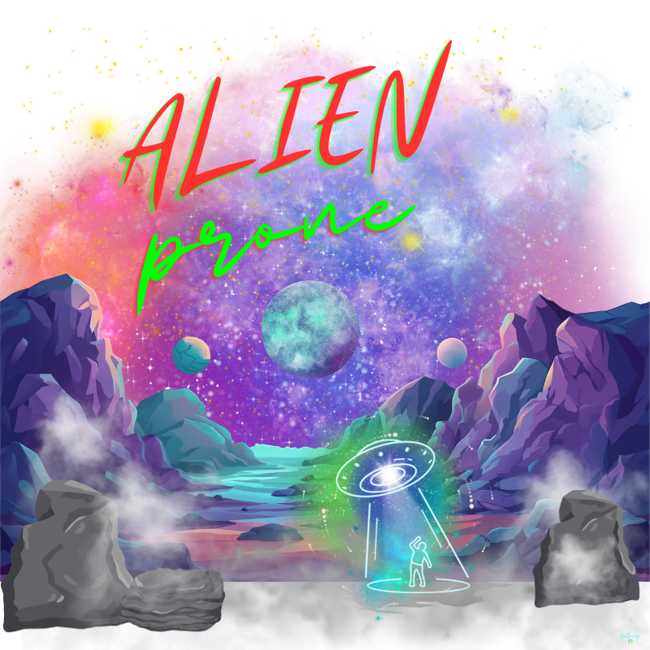

 

 
 

 

coming soon!

### 

  - [OVERVIEW](#overview)
    - [*user story*](#user-story)
    - [*acceptance criteria*](#acceptance-criteria)
    - [*probe-list*](#borea-list)
  - [INSTALLATION](#installation)
  - [USAGE](#usage)
    - [*screenshot*](#screenshot)
    - [*demo*](#demo)
  - [TESTING](#testing)
  - [SOURCES](#sources)
  - [LICENSE](#license)
  - [LINKS](#links)
  - [CONNECT](#connect)
