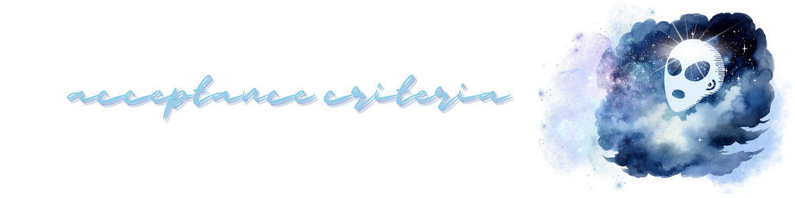
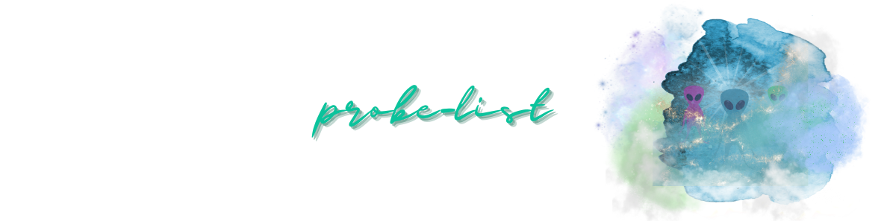

<p align="center">

</p>

[](https://opensource.org/licenses/MIT) 
[](https://nodejs.org/en)
[](https://www.mysql.com)
[](https://expressjs.com/)
[](https://canva.com)

[](https://canva.com)
[](https://www.npmjs.com/package/nodemon)
[](https://canva.com/) 
[](https://heroku.com) 
[](https://canva.com/)

[](https://canva.com/) 


### 

  - [OVERVIEW](#overview)
    - [*user story*](#user-story)
    - [*acceptance criteria*](#acceptance-criteria)
    - [*probe-list*](#borea-list)
  - [INSTALLATION](#installation)
  - [USAGE](#usage)
    - [*screenshot*](#screenshot)
    - [*demo*](#demo)
  - [TESTING](#testing)
  - [SOURCES](#sources)
  - [LICENSE](#license)
  - [LINKS](#links)
  - [CONNECT](#connect)

### 

`ALIEN PRONE` is a CMS style blog site for abductees to publish UFO sightings, recent abductions, thoughts & opinions. The app follows the MVC paradigm in its architectural structure, using [Handlebars.js]() as the templating language,[Sequelize](https://www.npmjs.com/package/sequelize) as the ORM, and the [express-session](https://www.npmjs.com/package/express-session) npm package for authentication.

* [express-handlebars](https://www.npmjs.com/package/express-handlebars) package to implement [Handlebars.js]() for *views*.

* [MySQL2](https://www.npmjs.com/package/mysql2) and [Sequelize](https://www.npmjs.com/package/sequelize) packages to connect  to `ALIEN PRONE's` **database** for *models*

* [Express.js]() API for *controllers*.

* [dotenv](https://www.npmjs.com/package/dotenv) package to use environment variables to **store sensitive data**, [bcrypt package](https://www.npmjs.com/package/bcrypt) to **hash passwords**, & [express-session](https://www.npmjs.com/package/express-session) and  [connect-session-sequelize](https://www.npmjs.com/package/connect-session-sequelize) packages to add **authentication**.

#
>The [express-session](https://www.npmjs.com/package/express-session) package stores the session data on the client in a cookie - when an abductee is idle on `ALIEN PRONE` for more than a set time, the cookie will expire and the abductee will be required to log in again to start a new session.
#


### 
<p align="center">
  
</p>

### 
<p align="center">
  
</p>

### 
<p align="center">
  
</p>

#

### 

The application is invoked using the following commands:

##### *Clone the repository in your local development enviornment.*

```
git clone https://github.com/christiecamp/alien-prone.git
```
##### **Create a *.env* with your information**

##### *Navigate to the command line and input:*

```javascript
npm i :: express, mysql2, dotenv --save, sequelize, nodemon --save-dev, handlebars, express-session, express-handlebars, bcypt, connect-session-sequelize
```
```javascript
mysql -u root -p
```
```mysql
SOURCE db/schema.sql;
quit
```
```javascript
npm run seed
```
```javascript
nodemon server
```

#

### 

**INSTRUCTIONS:**

1. Open the Integrated Terminal and follow the [installation](#installation) guidelines

2. Interact with `ALIEN PRONE's` back end with [Insomnia](https://www.npmjs.com/package/inquirer/v/8.2.4) by testing the below:
      * GET all users, posts, comments
      * GET user, post, comment by id
      * CREATE user, post, comment
      * UPDATE user, post, comment
      * DELETE post, comment

      ##### view [demo videos](#demo) and [testing](#testing) 
3. Open the [application](https://alien-prone-f88dde7c7c2c.herokuapp.com/) deployed on [Heroku](https://heroku.com/home)
4. Signup by creating a **username/password**
5. *Create*, *update*, and *delete* probe posts through your dashboard
6. *View* all probe posts via the homepage
7. Interact with each probe post by leaving a **comment** to empathize with the distressed.
8. *Logout* to leave the application

### 
             
##### *screenshot demonstrates `ALIEN PRONE's` back end, testing all routes with **Insomnia**, and the functional application deployed on **Heroku***

<p align="center">

</p>


### 

##### **users**

<!-- <p align="left">

</p> -->

##### **posts**

<!-- <p align="left">

</p> -->


##### **comments**

<!-- <p align="left">

</p> -->

#

### 

**TESTING WITH INSOMNIA:**

There are different tools available that can test reading/writing operations in a web browser - in this application we use [Insomnia](https://insomnia.rest/), a *REST client* that makes it easy to send **HTTP requests** to an API and view response details. 

1. After installing Insomnia, open a new document.

2. Interact with `ALIEN PRONE's` back end by testing the below commands:

##### **GET** all users, posts, comments
```json
http://localhost:3013/api/user
```
```json
http://localhost:3013/api/post
```
```json
http://localhost:3013/api/comment
```


##### **GET** category by *id*
```json
http://localhost:3013/api/user/1
```

##### **CREATE** post
```json
http://localhost:3013/api/post/
```
```json
{
	"title": "",
	"content": ""
}
```

##### **UPDATE** post
```json
http://localhost:3013/api/post/1
```
```json
{
  "title": "",
  "content": ""
}
```
##### **DELETE** post
```json
http://localhost:3013/api/post/
```

#

### 

Here's a list of technologies used:

1. [Node.js](https://nodejs.org/en) - is an open-source, cross-platform JavaScript runtime environment.

2. [Express.js]((https://expressjs.com)) - a minimal and flexible Node.js web application framework that provides a robust set of features for web and mobile applications.

3. [Handlebars.js](https://handlebarsjs.com/) - a JavaScript templating library used in web development to create dynamic web pages and generate HTML content based on data.

4. [MySQL2](https://www.npmjs.com/package/mysql2) - MySQL is a relational database management system based on SQL – Structured Query Language.

5. [Sequelize](https://sequelize.org/) - a Node.js based `Object Relational Mapper` that makes it easy to work with **MySQL databases**. An *Object Relational Mapper* performs functions like handling database records by representing the data as objects.

6. [express-handlebars](https://www.npmjs.com/package/express-handlebars) - a Handlebars view engine for Express which doesn't suck.

7. [express-session](https://www.npmjs.com/package/express-session) - a Node.js module that offers simple session middleware for Express.

8. [connect-session-sequelize](https://www.npmjs.com/package/connect-session-sequelize) - a SQL session store using Sequelize.js.

9. [Bcyrpt](https://www.npmjs.com/package/bcrypt) - a Node.js library to help hash passwords.

10. [Dotenv](https://www.npmjs.com/package/dotenv) - a zero-dependency module that loads environment variables from a .env file into `process.env`.

11. [Nodemon](https://www.npmjs.com/package/nodemon) - a Node.js tool that helps develop applications by automatically restarting the node application when file changes in the directory are detected.

12. [Insomnia](https://insomnia.rest/) - an open source desktop application that assists in designing, debugging, and testing APIs (specifically in this instance, HTTP-based RESTful APIs).

13. [Heroku](https://heroku.com) - used to deploy, manage, and scale the application.


### 

##### [mit license](./LICENSE)


### 

##### [*github repo*](https://github.com/christiecamp/alien-prone)

##### [*deployed app*](https://alien-prone-f88dde7c7c2c.herokuapp.com/)

### 

[](https://github.com/christiecamp/bear-taker)

<a href="mailto:christiecamphoto@gmail.com">

</a>

#
<p align="center">
<a href="https://www.christiecamp.com"></a>
</p>

<!-- https://www.asciiart.eu/space/aliens -->